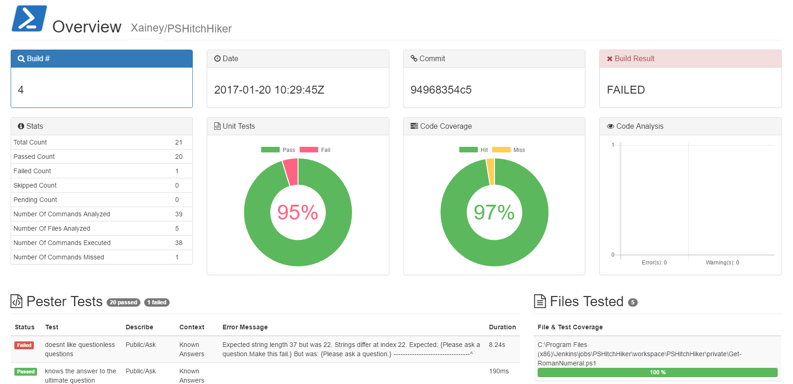
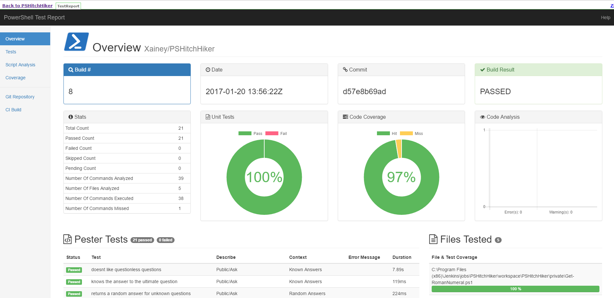

# PSTestReport

Early example to generate a static PowerShell test report.

CDN references are included for most common libraries.

The output could be reduced to a single file or the additional common assets served by a web server.

Must export Pester and PSScript Analyzer results to JSON.

## Step 1: Run/Save tests

```
$testresults = Invoke-Pester -CodeCoverage "*.ps1" -PassThru
$testresults | ConvertTo-Json -Depth 5 | Set-Content ".\artifacts\PesterResults.json"

$SAResults = Invoke-ScriptAnalyzer -Path . -Severity @('Error', 'Warning') -Recurse -Verbose:$false
$SAResults | ConvertTo-Json | Set-Content ".\artifacts\ScriptAnalysisResults.json"
```

## Step 2: Run Invoke-PSTestReport script

```
# Example: 
$options = @{
  BuildNumber = 0
  GitRepo = "Xainey/PSHitchhiker"
  GitRepoURL = "https://github.com/Xainey/PSHitchhiker"
  CiURL = "http://jenkins/job/PSHitchhiker/"
  ShowHitCommands = $false
  Compliance = 0.4
  ScriptAnalyzerFile = ".\artifacts\ScriptAnalyzerResults.json"
  PesterFile = ".\artifacts\PesterResults.json"
  OutputDir = ".\artifacts"
}

.\Invoke-PSTestReport.ps1 @options
```

## Example



## Example with sidebar in Jenkins

